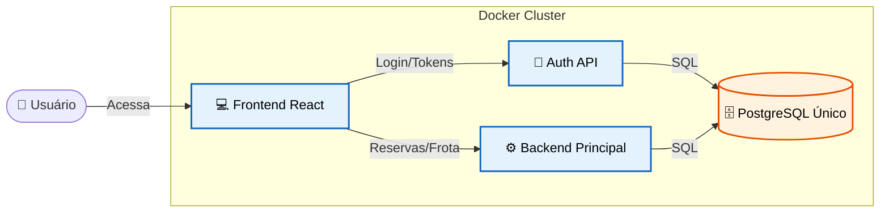

# 🚗 FrotaNext - Sistema de Locação e Gestão de Frotas

> **🚀 Sistema ao vivo:** [Acesse o FrotaNext em Produção](http://137.131.229.125:3000)  
> **📖 Documentação Completa:** [Acesse o Portal de Documentação](COLOQUE_AQUI_O_LINK_DO_SEU_MKDOCS_PUBLICADO)

O **FrotaNext** é uma plataforma moderna e escalável de **Aluguel de Veículos (Rent-a-Car)**. 

Projetado com uma arquitetura de microsserviços, o sistema gerencia todo o ciclo de vida da locação: desde a vitrine de veículos e reserva pelo cliente, até a gestão de frotas, motoristas corporativos e aprovações administrativas.

---

## 🎥 Demonstração do Sistema

Confira abaixo o vídeo com a jornada completa de ponta a ponta, demonstrando os fluxos do Administrador, do Cliente Pessoa Física e da Empresa (Pessoa Jurídica):

<div align="center">
  <a href="https://youtu.be/W33DMWiJJQI" target="_blank">
    
  </a>
  <p><em>Clique na imagem para assistir à demonstração no YouTube.</em></p>
</div>

---

## 🔗 Repositórios do Projeto (Multi-repo)

Para manter as responsabilidades separadas e facilitar a escalabilidade, o ecossistema do projeto é dividido em quatro repositórios distintos. **Este repositório atua como o Orquestrador.**

* 📍 **Você está aqui:** Orquestração (Docker Compose), Documentação e Testes Visuais.
* 💻 **[Frontend (React)](https://github.com/GG555-13/FrotaNext-Frontend):** Interface de usuário (SPA) construída com Vite, TypeScript e Tailwind CSS.
* ⚙️ **[Backend Principal (FastAPI)](https://github.com/GG555-13/FrotaNext-Backend):** API Core responsável pela gestão da frota e regras de negócio de reservas.
* 🔐 **[Auth Service (FastAPI)](https://github.com/GG555-13/FrotaNext-Auth):** API de Identidade responsável por logins, hash de senhas e emissão de tokens JWT.

---

## 🏛️ Arquitetura em Resumo

O sistema foi construído sobre o princípio da **separação de responsabilidades**. Em vez de um monólito gigante, dividimos a aplicação em serviços especializados que rodam em contêineres Docker.



---

## 🛠️ Stack Tecnológica

Utilizamos tecnologias modernas para garantir performance, tipagem segura e facilidade de manutenção.

### 💻 Frontend

* **React 18 (Vite):** Para uma interface super rápida (SPA).
* **TypeScript:** Segurança de tipos e prevenção de bugs.
* **Tailwind CSS & React Hook Form:** Estilização moderna e gestão eficiente de formulários.

### ⚙️ Backends (Microsserviços)

* **Python 3.11 & FastAPI:** Framework de alta performance e assíncrono.
* **SQLAlchemy + Pydantic:** ORM e validação de dados rigorosa.
* **Pytest:** Suíte de testes automatizados.

### ☁️ Infraestrutura

* **Docker & Docker Compose:** Containerização total do ambiente de dev e produção.
* **PostgreSQL 15:** Banco de dados relacional (com estratégia de Herança de Tabelas).
* **Oracle Cloud (OCI):** Hospedagem em nuvem (Linux Ubuntu).

---

## 🚀 Funcionalidades Principais

O sistema atende a três perfis distintos de usuário:

* 👤 **Para Clientes (PF):** Vitrine digital, simulação de preços em tempo real e histórico de reservas.
* 🏢 **Para Empresas (PJ):** Painel exclusivo para cadastrar e gerenciar motoristas vinculados ao CNPJ para retirada de veículos.
* 🛡️ **Para Administradores:** Dashboard de KPIs, controle completo da frota e operação de pátio (Aprovação, Retirada e Devolução).

---

## ⚙️ Como Rodar o Projeto Localmente

Como o projeto é totalmente conteinerizado, você só precisa ter o **Docker** instalado.

1. Clone este repositório orquestrador:
```bash
git clone [https://gitlab.com/GG-555/frota-documentacao.git](https://gitlab.com/GG-555/frota-documentacao.git) FrotaNext
cd FrotaNext
```


2. Clone os microsserviços dentro da pasta `FrotaNext` (respeite os nomes exatos):
```bash
git clone https://github.com/GG555-13/FrotaNext-Frontend.git FrotaNext-Frontend-main
git clone https://github.com/GG555-13/FrotaNext-Auth.git FrotaNext-Backend-main
git clone https://github.com/GG555-13/FrotaNext-Auth.git FrotaNext-Auth-main
```


3. Suba toda a infraestrutura:
```bash
docker compose up -d --build
```


4. Popule o banco de dados com o administrador padrão e veículos de teste:
```bash
docker compose exec backend python reset-popula.py
```
