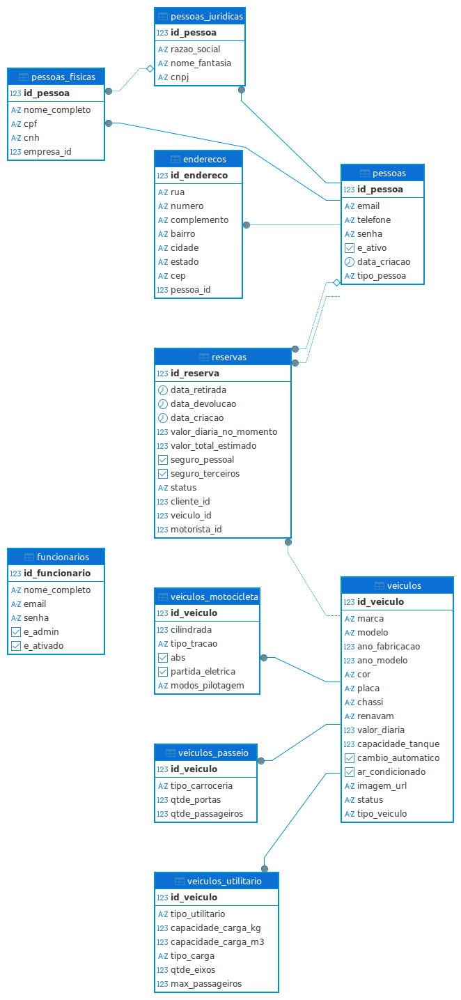

# Banco de Dados e Modelagem

!!! info "PostgreSQL 15"
    O **FrotaNext** utiliza o PostgreSQL como sistema gerenciador de banco de dados relacional (RDBMS). A modelagem foi projetada para suportar alta integridade referencial e o padrão de **Herança de Tabelas** (Joined Inheritance).

---

## 🗺️ Diagrama Entidade-Relacionamento (ER)

O diagrama abaixo ilustra a estrutura física do banco, destacando as chaves primárias (PK), estrangeiras (FK) e os relacionamentos.



---

## 🏗️ Estrutura das Tabelas

O banco foi desenhado para evitar redundância de dados, utilizando tabelas base para entidades compartilhadas.

### 1. Núcleo de Usuários (Herança)

Utilizamos a estratégia *Joined Table* para lidar com Pessoas Físicas e Jurídicas.

| Tabela | Descrição | Relacionamento |
| :--- | :--- | :--- |
| **`pessoas`** | Tabela pai. Armazena dados comuns: ID, email, telefone, senha (hash) e status. | 1:1 com `enderecos`. |
| **`pessoas_fisicas`** | Extensão de pessoa. Contém CPF, CNH e Nome Completo. | FK `id_pessoa` -> `pessoas`. |
| **`pessoas_juridicas`** | Extensão de pessoa. Contém CNPJ, Razão Social e Fantasia. | FK `id_pessoa` -> `pessoas`. |
| **`funcionarios`** | Tabela isolada para administradores do sistema. | Não herda de pessoas (acesso administrativo separado). |

!!! abstract "Vínculo Corporativo"
    A tabela `pessoas_fisicas` possui uma coluna `empresa_id` (FK). Isso permite vincular um motorista (PF) a uma empresa (PJ), habilitando a funcionalidade de **Gestão de Condutores**.

---

### 2. Gestão de Frota (Herança)

Assim como os usuários, os veículos seguem um modelo hierárquico.

| Tabela | Descrição | Dados Específicos |
| :--- | :--- | :--- |
| **`veiculos`** | Tabela pai. Dados globais: Placa, Marca, Modelo, Ano, Cor, Diária. | Define o `status` (Disponível, Alugado). |
| **`veiculos_passeio`** | Carros de passeio. | Tipo de carroceria, Portas, Passageiros, Ar Condicionado. |
| **`veiculos_motocicleta`** | Motos e Scooters. | Cilindrada, Partida Elétrica, ABS. |
| **`veiculos_utilitario`** | Veículos de carga. | Capacidade de Carga (kg/m³), Dimensões. |

---

### 3. Operação (Reservas)

A tabela `reservas` é o coração transacional do sistema.

* **`cliente_id`**: Quem paga a reserva (PF ou PJ).
* **`motorista_id`**: Quem retira o veículo (Condutor). Se o cliente for PJ, este campo é obrigatório.
* **`veiculo_id`**: O carro alugado.
* **`valores`**: Armazenamos o `valor_diaria_no_momento` como um *snapshot*. Se o preço do carro mudar no futuro, o histórico da reserva antiga não é alterado.

---

## 🛡️ Tipos Enumerados (Enums)

Para garantir a consistência dos dados e evitar "strings mágicas", utilizamos ENUMs nativos do PostgreSQL.

=== "Status de Veículo"
    * `disponível`
    * `reservado`
    * `alugado`
    * `em manutenção`

=== "Status de Reserva"
    * `pendente` (Aguardando aprovação)
    * `confirmada` (Aprovada pelo Admin)
    * `em_andamento` (Veículo retirado)
    * `finalizada` (Veículo devolvido)
    * `cancelada`

=== "Cores"
    Padronização para filtros: `Preto`, `Branco`, `Prata`, `Cinza`, `Vermelho`, `Azul`, etc.

---

## ⚡ Índices e Performance

Criamos índices estratégicos para acelerar as consultas mais frequentes do Frontend e do Painel Administrativo.

```sql
CREATE INDEX idx_veiculos_status ON veiculos (status); 
CREATE INDEX idx_reservas_status ON reservas (status); 
CREATE INDEX idx_reservas_data_retirada ON reservas(data_retirada); -
CREATE INDEX idx_pessoas_fisicas_empresa ON pessoas_fisicas(empresa_id); 
```
