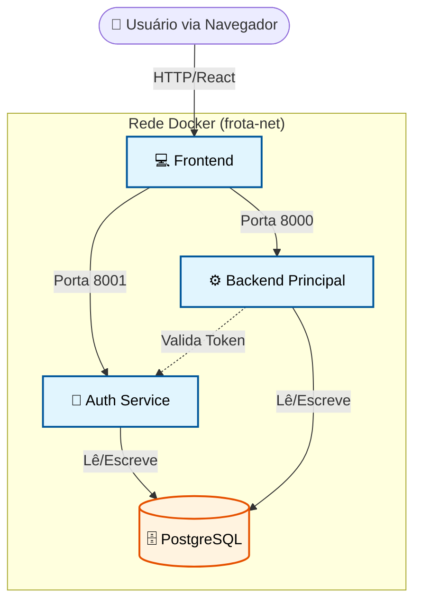

# Visão Geral da Arquitetura

!!! info "Resumo"
    O **FrotaNext** foi desenhado seguindo uma arquitetura de **Microsserviços**. Isso significa que o sistema é composto por pequenas aplicações independentes que trabalham juntas, em vez de um único bloco monolítico.

    Essa abordagem facilita a manutenção, permite escalar partes específicas do sistema (ex: escalar apenas a API de reservas) e isola falhas.

---

## 🗺️ Diagrama de Componentes

O diagrama abaixo ilustra como os contêineres interagem dentro da rede Docker e como o usuário acessa o sistema.

-----

## 🧩 Os Microsserviços

O sistema é composto por 4 serviços principais, orquestrados via Docker Compose.

### 1\. Frontend (`frota-frontend`)

  * **Tecnologia:** React 18, Vite, TypeScript.
  * **Responsabilidade:** Interface do usuário (SPA). Não acessa o banco de dados diretamente.
  * **Comunicação:** Faz requisições HTTP (Axios) para as APIs de Backend e Auth.

### 2\. Auth Service (`frota-auth`)

  * **Tecnologia:** Python (FastAPI), SQLAlchemy.
  * **Responsabilidade:** **Identity Provider (IdP)**. Cuida exclusivamente de:
      * Cadastro de usuários (PF e PJ).
      * Login e Hash de Senha (Argon2).
      * Emissão de Tokens JWT.
  * **Isolamento:** Se este serviço cair, novos usuários não logam, mas quem tem token válido continua usando o sistema por um tempo.

### 3\. Backend Principal (`frota-backend`)

  * **Tecnologia:** Python (FastAPI), SQLAlchemy.
  * **Responsabilidade:** **Core Business**. Gerencia:
      * Veículos e categorias.
      * Regras de Reserva (cálculo de dias, multas).
      * Dashboard Administrativo.
  * **Segurança:** Valida os tokens JWT emitidos pelo Auth Service antes de permitir ações.

### 4\. Banco de Dados (`frota-db`)

  * **Tecnologia:** PostgreSQL 15.
  * **Estratégia:** Banco Único Compartilhado (Shared Database).
      * Embora sejam microsserviços, optamos por um banco único para simplificar a integridade referencial (Foreign Keys) entre `Reservas` (Backend) e `Clientes` (Auth), facilitando joins e relatórios nesta fase do projeto.

-----

## 🔄 Fluxos de Comunicação

### Fluxo de Requisição (Request Flow)

Todas as requisições seguem o padrão RESTful/JSON.

1.  **Login:** O Frontend envia credenciais para o **Auth Service**.
2.  **Token:** Se válido, o Auth Service retorna um **JWT (Access Token)**.
3.  **Uso:** O Frontend armazena esse token e o anexa no Header `Authorization: Bearer ...` de cada requisição para o **Backend Principal**.
4.  **Validação:** O Backend Principal verifica a assinatura do token (usando a `SECRET_KEY` compartilhada) para saber quem é o usuário sem precisar perguntar ao banco a cada vez.

-----

## 📐 Padrões de Projeto

Utilizamos padrões robustos para garantir a qualidade do código.

=== "Backend"
* **Repository Pattern (Simplificado):** Uso de *Services* para isolar a lógica de negócio dos *Routers* (Controladores).
* **Dependency Injection:** O FastAPI injeta sessões de banco e usuários logados nas rotas.
* **Pydantic Schemas:** Camada de DTO (Data Transfer Object) para validar dados de entrada e saída.

=== "Frontend"
* **Component-Based:** Interface dividida em pequenos blocos reutilizáveis (Botões, Cards, Modais).
* **Hooks Customizados:** Lógica de estado complexa separada da visualização.
* **Context API:** Gerenciamento de estado global para a sessão do usuário (AuthContext).

=== "Banco de Dados"
* **Joined Inheritance:** Uso de polimorfismo para tratar `PessoaFisica` e `PessoaJuridica` como especializações de uma tabela `Pessoas` genérica.

