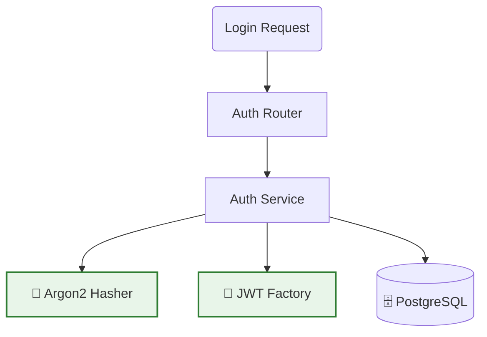

# Auth Service (Identidade)

!!! info "Visão Geral"
    O **Auth Service** (ou `frota-auth`) é o microsserviço responsável exclusivamente pela gestão de identidade e controle de acesso.
    
    Ele atua como um **Identity Provider (IdP)** para o ecossistema FrotaNext: valida credenciais, emite tokens de acesso (JWT) e gerencia o cadastro de novos usuários.

---

## 🔐 Arquitetura de Segurança

Diferente do Backend Principal, este serviço foca em criptografia e validação.

### Componentes Chave

  * **`seguranca.py`:** Módulo core que contém:
      * Configuração do **Passlib** para hash de senhas.
      * Configuração do **Python-Jose** para criar e decodificar tokens JWT.
  * **Routers:** Endpoints para login (`/token`), cadastro de PF (`/clientes/pf`) e PJ (`/clientes/pj`).

-----

## 🛡️ Padrões de Segurança

Utilizamos padrões da indústria para garantir que os dados sensíveis estejam protegidos.

### 1. Hash de Senha (Argon2)

Não salvamos senhas em texto puro. Utilizamos o algoritmo **Argon2**, vencedor da *Password Hashing Competition*, que é resistente a ataques de força bruta baseados em GPU.

### 2. Tokens JWT (JSON Web Tokens)

A autenticação é *stateless* (sem sessão no servidor).

  * **Formato:** Bearer Token.
  * **Algoritmo de Assinatura:** HS256 (HMAC com SHA-256).
  * **Payload:** O token carrega o `sub` (ID do usuário) e o `tipo` (admin, cliente\_pf, cliente\_pj), permitindo que o Backend Principal valide permissões sem consultar o banco toda vez.

-----

## 🚦 Fluxo de Autenticação

1.  **Login:** O Frontend envia `email` e `senha` para o endpoint `/auth/token`.
2.  **Validação:** O Auth Service busca o hash no banco e compara com a senha enviada.
3.  **Emissão:** Se válido, retorna um `access_token` com expiração definida (ex: 30 minutos).
4.  **Uso:** O Frontend anexa esse token no header `Authorization: Bearer <token>` para todas as requisições subsequentes ao Backend Principal.

-----

## 🛠️ Comandos de Desenvolvimento

Dentro do container `frota-auth` (ou `auth-service` dependendo do seu docker-compose), você pode rodar:

| Comando | Descrição |
| :--- | :--- |
| `pytest -v` | Roda os testes de autenticação. |
| `alembic upgrade head` | (Se houver) Aplica migrações de banco específicas. |

!!! warning "Nota sobre a Pasta"
Se você estiver rodando localmente fora do Docker, lembre-se que o código deste serviço reside na pasta **`frota-auth/`** (anteriormente chamada de *auth-api*).

