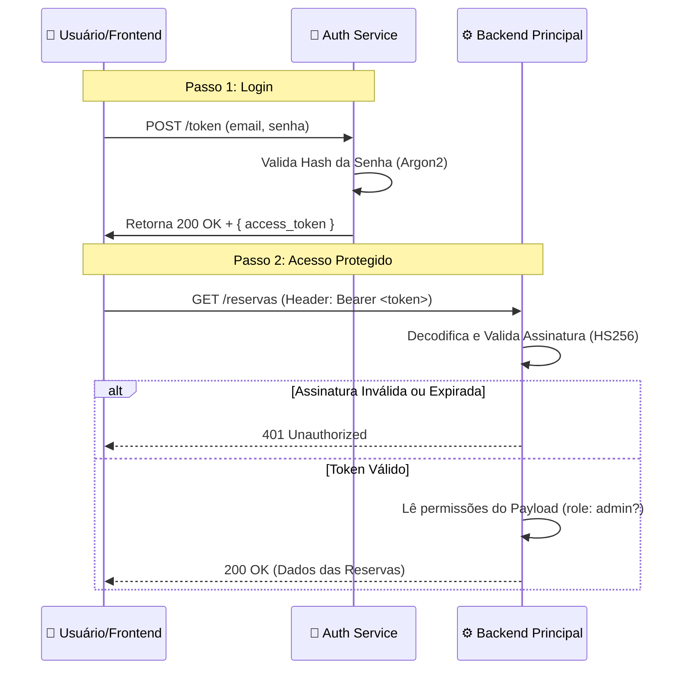

# Fluxo de Autenticação JWT

O FrotaNext utiliza **JSON Web Tokens (JWT)** para autenticação *stateless* (sem estado). Isso significa que o servidor não precisa guardar uma sessão na memória para cada usuário logado; todas as informações necessárias estão contidas no próprio token assinado.

---

## 🔄 O Ciclo de Vida da Requisição

O diagrama abaixo ilustra como o Frontend interage com os microsserviços usando o token.



-----

## 🎟️ Estrutura do Token

Nosso token é composto por três partes codificadas em Base64 e separadas por pontos (`.`).

### 1\. Header (Cabeçalho)

Define o algoritmo de assinatura utilizado.

```json
{
  "alg": "HS256",
  "typ": "JWT"
}
```

### 2. Payload (Carga Útil)

Contém os dados do usuário (Claims). É aqui que definimos **quem** é o usuário e **o que** ele pode fazer.

| Campo | Significado | Exemplo |
| :--- | :--- | :--- |
| **`sub`** | *Subject* (Identificador único) | `123` (ID do usuário) |
| **`exp`** | *Expiration* (Validade) | `1735689600` (Timestamp Unix) |
| **`tipo`** | *Role* (Perfil de acesso) | `admin`, `cliente_pf` ou `cliente_pj` |
| **`email`** | Email do usuário | `admin@frotanext.com` |

!!! warning "Segurança do Payload"
O Payload é apenas codificado em Base64, **não é criptografado**. Qualquer pessoa com o token pode ler esses dados. Por isso, **nunca colocamos senhas** dentro do token.

### 3. Signature (Assinatura)

É a garantia de que o token não foi alterado. Ela é gerada combinando o Header, o Payload e a nossa **`SECRET_KEY`**.

```python
HMACSHA256(
  base64UrlEncode(header) + "." +
  base64UrlEncode(payload),
  SECRET_KEY
)
```

Se um usuário mal-intencionado tentar mudar o `tipo` de `cliente` para `admin` no payload, a assinatura não baterá e o Backend rejeitará a requisição.

-----

## 🔐 Segredo Compartilhado (`SECRET_KEY`)

Como o **Auth Service** (que cria o token) e o **Backend Principal** (que valida o token) são serviços separados, eles precisam compartilhar a mesma chave secreta para que a validação funcione.

Isso é configurado via Variáveis de Ambiente no `docker-compose.yml`:

```yaml
services:
  auth-service:
    environment:
      - SECRET_KEY=sua_chave_super_secreta_compartilhada_123

  backend:
    environment:
      - SECRET_KEY=sua_chave_super_secreta_compartilhada_123 # A MESMA CHAVE!
```

-----

## 🚦 Proteção de Rotas (Dependências)

No código do Backend (FastAPI), usamos dependências injetáveis para proteger rotas.

```python
@router.get("/veiculos", dependencies=[Depends(obter_usuario_logado)])
def listar_veiculos():
    ...
```

A função `obter_usuario_logado`:

1.  Extrai o token do Header `Authorization`.
2.  Decodifica usando a `SECRET_KEY`.
3.  Verifica se o token expirou (`exp`).
4.  Retorna o usuário ou lança exceção `401 Unauthorized`.

-----

## 🛡️ Hashing de Senhas (Argon2)

Embora o JWT cuide da sessão, as senhas armazenadas no banco precisam ser protegidas. Utilizamos o algoritmo **Argon2**, que é o padrão ouro atual para hashing de senhas.

  * **Salting:** Adiciona dados aleatórios antes do hash para evitar ataques de *Rainbow Tables*.
  * **Custo de Memória/Tempo:** Configurável para tornar ataques de força bruta computacionalmente inviáveis.

