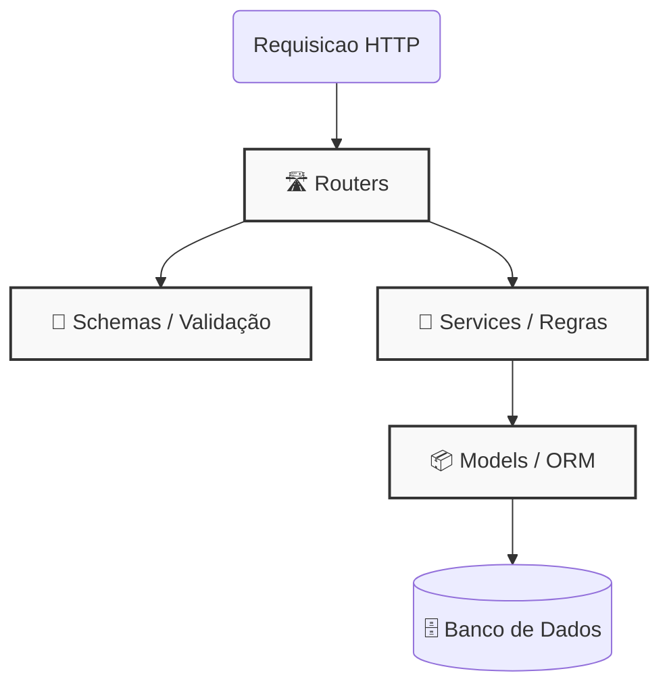

# Backend Principal (Core)

!!! info "Visão Geral"
    O **Backend Principal** é o coração do FrotaNext. É uma API REST desenvolvida em **Python** com **FastAPI** que centraliza todas as regras de negócio críticas do sistema, como gestão da frota, cálculo de preços de reservas e o ciclo de vida da locação.

    Ele roda na porta `:8000` e se conecta ao banco PostgreSQL compartilhado.

---

## 🏗️ Arquitetura e Padrões

O projeto segue uma arquitetura limpa de separação de responsabilidades, dividida em 4 camadas principais para garantir organização e testabilidade.

### 1. 🛣️ Routers (`/routers`)

  * **Função:** Receber as requisições HTTP, validar os dados de entrada (usando Schemas) e devolver as respostas.
  * **Responsabilidade:** Não contém lógica de negócio complexa. Apenas orquestra a chamada para os *Services*.
  * **Exemplo:** `veiculo_router.py`, `reserva_router.py`.

### 2. 🧠 Services (`/services`)

  * **Função:** O cérebro da aplicação. Onde moram as regras de negócio.
  * **Responsabilidade:** Calcular multas, verificar disponibilidade de datas, validar regras de estado (ex: não pode finalizar uma reserva que não começou).
  * **Exemplo:** `reserva_service.py` (cálculo de dias vs. diárias).

### 3. 📦 Models (`/models`)

  * **Função:** Representação das tabelas do banco de dados (SQLAlchemy).
  * **Responsabilidade:** Definir colunas, tipos de dados e relacionamentos (Foreign Keys).
  * **Exemplo:** `veiculo.py`, `reserva.py`.

### 4. 📑 Schemas (`/schemas`)

  * **Função:** Contratos de dados (Pydantic). Define o que a API espera receber (Input) e o que ela vai devolver (Output).
  * **Exemplo:** `reserva_schema.py` (garante que a data de devolução seja futura).

-----

## 🔑 Principais Funcionalidades

### 🚗 Gestão de Frota

CRUD completo de veículos com suporte a polimorfismo (diferentes tipos de veículos na mesma tabela base).

  * **Categorias:** Passeio, Utilitário, Motocicleta.
  * **Status:** Controle rigoroso (`disponível`, `reservado`, `alugado`, `manutenção`).

### 📅 Motor de Reservas

O sistema gerencia o ciclo de vida completo de uma locação:

1.  **Criação:** Verifica conflitos de agenda (Overbooking).
2.  **Confirmação:** Admin aprova a reserva.
3.  **Retirada (Check-out):** Veículo sai do pátio (Status muda para `alugado`).
4.  **Devolução (Check-in):** Veículo volta. O sistema calcula automaticamente:
      * Valor final baseado nos dias reais utilizados.
      * Multas por atraso.

-----

## 📚 Documentação Interativa (Swagger)

O FastAPI gera automaticamente uma documentação interativa e testável.

Quando o projeto estiver rodando, acesse:
[http://localhost:8000/docs](http://localhost:8000/docs)

<figure>

<figcaption>tela do swagger da FrotaNext</figcaption>
</figure>

-----

## 🛠️ Comandos de Desenvolvimento

Dentro do container `backend` (via `docker compose exec backend ...`), você pode rodar:

| Comando | Descrição |
| :--- | :--- |
| `pytest -v` | Roda toda a suíte de testes. |
| `pylint src/` | Verifica a qualidade do código (Linter). |
| `python reset-popula.py` | Reseta o banco e cria dados de teste. |

