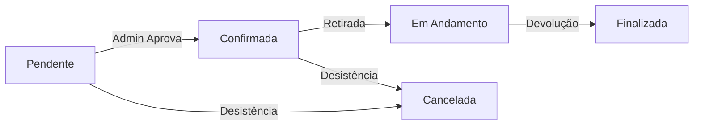

# Modelos de Dados e Regras (ORM)

!!! info "SQLAlchemy & ORM"
    O Backend utiliza o **SQLAlchemy** como ORM (Object Relational Mapper). Isso significa que as tabelas do banco são representadas como **Classes Python**.
    
    A estratégia de modelagem utilizada é a **Joined Table Inheritance** (Herança de Tabela), permitindo tratar diferentes tipos de entidades (ex: Carro vs Moto, PF vs PJ) de forma polimórfica.

---

## 🗺️ Visão Geral Visual

Abaixo, o diagrama físico que representa como o SQLAlchemy materializa as classes no PostgreSQL.

Um diagrama DDL no formato de um script .sql pode ser encontrado dentro do repositório com o nome de `FrotaNext-DDL.sql`.

---

## 👥 Módulo de Pessoas (Usuários)

A tabela `pessoas` é a base para todos os usuários do sistema. Ela armazena as credenciais de login e dados de contato comuns.

### Estrutura de Herança

1.  **`Pessoa` (Pai/Base):**
    * Contém: `id`, `email`, `senha` (hash), `telefone`, `ativo`.
    * Responsabilidade: Autenticação e bloqueio de acesso.

2.  **`PessoaFisica` (Filha de Pessoa):**
    * Contém: `cpf`, `nome_completo`, `cnh`.
    * **Funcionalidade Extra:** Pode ter um `empresa_id` (FK), vinculando este motorista a uma conta corporativa.

3.  **`PessoaJuridica` (Filha de Pessoa):**
    * Contém: `cnpj`, `razao_social`, `nome_fantasia`.
    * Funcionalidade: Pode gerenciar uma lista de motoristas (Pessoas Físicas) vinculados a ela.

---

## 🚗 Módulo de Frota (Veículos)

Similar às pessoas, os veículos compartilham características globais, mas possuem especificidades técnicas.

### Estrutura de Herança

1.  **`Veiculo` (Pai/Base):**
    * Dados: `placa`, `marca`, `modelo`, `ano`, `cor`, `valor_diaria`.
    * Controle: `status` (Disponível, Alugado, etc).

2.  **Especializações:**
    * **`Passeio`:** Carros comuns. Atributos: `qtde_portas`, `ar_condicionado`, `tipo_carroceria`.
    * **`Motocicleta`:** Motos. Atributos: `cilindrada`, `partida_eletrica`.
    * **`Utilitario`:** Vans e caminhonetes. Atributos: `capacidade_carga`, `tamanho_bau`.

!!! tip "Polimorfismo na Prática"
    Ao buscar veículos na API (`GET /veiculos`), o sistema retorna uma lista mista contendo carros, motos e utilitários. O Frontend usa o campo `tipo_veiculo` para decidir qual ícone mostrar.

---

## 📅 Módulo de Operação (Reservas)

A tabela `reservas` é o ponto central de transação do sistema, conectando um **Cliente**, um **Veículo** e um período de tempo.

### Campos Importantes

| Campo | Tipo | Descrição |
| :--- | :--- | :--- |
| `data_retirada` | DateTime | Data agendada ou efetiva da retirada. |
| `data_devolucao` | DateTime | Data prevista para retorno. |
| `valor_diaria_no_momento` | Float | **Snapshot de Preço:** Gravamos quanto custava a diária no dia da reserva. Se o preço do carro aumentar depois, a reserva antiga não é afetada. |
| `cliente_id` | FK | Quem paga a conta (PF ou PJ). |
| `motorista_id` | FK | Quem retira o carro (Obrigatório se o cliente for PJ). |

---

## 🚦 Estados e Enums

O sistema utiliza máquinas de estado rigorosas para garantir a consistência dos dados.

### Ciclo de Vida da Reserva (`StatusReservaEnum`)

  * **`PENDENTE`**: Cliente solicitou, aguardando aprovação.
  * **`CONFIRMADA`**: Admin validou, veículo bloqueado para o cliente.
  * **`EM_ANDAMENTO`**: Cliente retirou o veículo do pátio.
  * **`FINALIZADA`**: Veículo devolvido e vistoriado.
  * **`CANCELADA`**: Reserva anulada (sem cobrança se feito com antecedência).

### Status do Veículo (`StatusVeiculoEnum`)

  * **`DISPONIVEL`**: Pronto para alugar.
  * **`RESERVADO`**: Vinculado a uma reserva futura (não aparece na vitrine para as mesmas datas).
  * **`ALUGADO`**: Está na rua com cliente.
  * **`MANUTENCAO`**: No mecânico/limpeza (bloqueado para aluguel).

