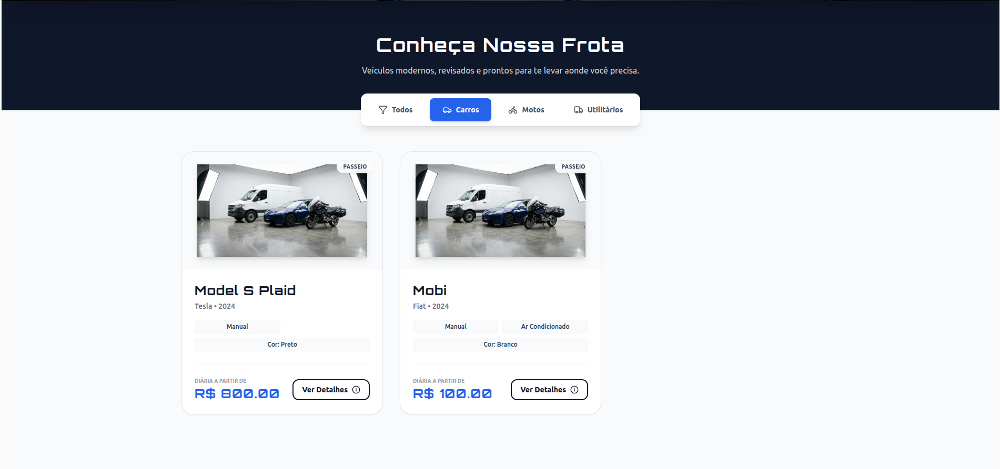
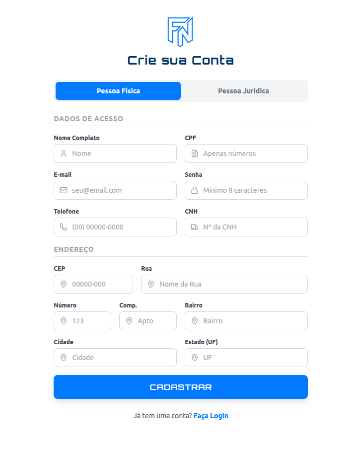
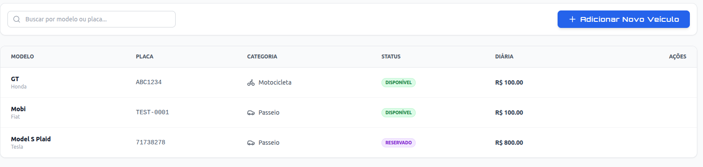
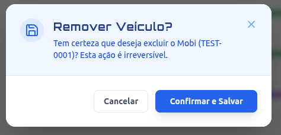
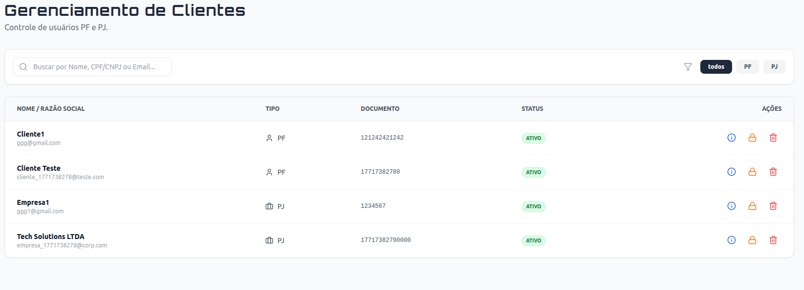

# Biblioteca de Componentes

!!! info "Design System"
    Para garantir consistência visual e agilidade no desenvolvimento, criamos um conjunto de **Componentes Reutilizáveis** baseados em Tailwind CSS.
    
    Eles residem na pasta `src/components/ui` e devem ser utilizados em preferência ao HTML puro.

---

## 1. Cards e Containers

Utilizados para agrupar informações relacionadas, como detalhes de um veículo ou resumo de uma reserva.

### `Card`
O bloco construtivo básico. Possui sombra suave, bordas arredondadas e padding padrão.

* **Uso:** Dashboards, Listagem de Frota, Detalhes.
* **Exemplo Visual:** Vitrine de veículos.

---

## 2. Elementos de Formulário

Padronizados para funcionar com **React Hook Form**, garantindo acessibilidade e validação visual de erros.

### `Input` e `Select`
Campos de texto e seleção com estados de:
* **Normal:** Borda cinza suave.
* **Focus:** Borda azul (`ring-2 ring-blue-500`).
* **Erro:** Borda vermelha com mensagem de validação abaixo.

---

## 3. Feedback e Status

Componentes visuais para informar o usuário sobre o estado de uma entidade.

### `Badge`
Pequenas etiquetas coloridas usadas em tabelas e cards para indicar status.

| Cor | Significado (Veículo) | Significado (Reserva) |
| :--- | :--- | :--- |
| ● Verde | `Disponível` | `Confirmada` |
| ● Azul | `Alugado` | `Em Andamento` |
| ● Laranja | `Manutenção` | `Pendente` |
| ● Vermelho | `Indisponível` | `Cancelada` |
| ● Cinza | - | `Finalizada` |

---

## 4. Modais e Diálogos

Utilizados para ações críticas que exigem confirmação ou foco total do usuário.

### `Modal`
Uma janela sobreposta com fundo escurecido (*backdrop*).

 "Modal de Perigo (Delete)"
    

 "Modal de Confirmação (Reserva)"
    

---

## 5. Navegação e Estrutura

### `Sidebar` (Admin)
Menu lateral fixo para a área administrativa, com links ativos destacados em azul.

### `Navbar` (Cliente)
Barra superior para clientes, contendo links rápidos e menu de perfil.

---

## 6. Tabelas de Dados

Componente complexo para exibição de listas densas (Admin).
* **Features:** Cabeçalho fixo, linhas quebradas (hover), ações alinhadas à direita.

