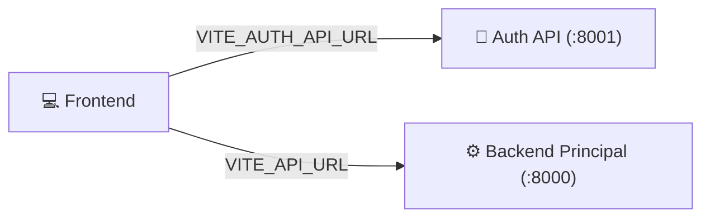

# Frontend (Interface Web)

!!! info "Visão Geral"
    O **Frontend** do FrotaNext é uma **Single Page Application (SPA)** moderna, construída com **React 18** e **Vite**.
    
    Ele atua como a única camada de interação com o usuário, consumindo os microsserviços de Backend e Auth via requisições HTTP (REST/JSON). O design é totalmente responsivo, adaptando-se a desktops e dispositivos móveis.

---

## 💻 Stack Tecnológica

Escolhemos ferramentas que priorizam performance, tipagem estática e produtividade.

| Tecnologia | Função | Por que escolhemos? |
| :--- | :--- | :--- |
| **React 18** | Biblioteca de UI | Componentização e gestão de estado eficiente. |
| **Vite** | Build Tool | Builds extremamente rápidos e *Hot Module Replacement* (HMR) instantâneo. |
| **TypeScript** | Linguagem | Segurança de tipos, evitando erros comuns de `undefined` ou dados incorretos vindos da API. |
| **Tailwind CSS** | Estilização | Utility-first CSS para criar layouts bonitos sem escrever arquivos `.css` gigantes. |
| **Axios** | HTTP Client | Gerencia requisições, interceptores de token e tratamento de erros global. |
| **React Hook Form** | Formulários | Validação de formulários complexos (cadastro, reservas) com mínima re-renderização. |

---

## 🔌 Integração com APIs

O Frontend precisa conversar com **dois serviços distintos**. Para isso, configuramos URLs base via variáveis de ambiente (`.env`).

### Autenticação Transparente (Interceptors)

Utilizamos **Axios Interceptors** para injetar automaticamente o token JWT em cada requisição.

1.  **Login:** O usuário digita senha. O Frontend recebe o token do Auth Service.
2.  **Armazenamento:** O token é salvo no `localStorage` (ou Cookie).
3.  **Request:** O interceptor "prende" a saída de qualquer requisição para o Backend Principal e adiciona o header:
    `Authorization: Bearer <token_salvo>`
4.  **Expiração:** Se a API retornar `401 Unauthorized`, o Frontend redireciona automaticamente para a tela de Login.

-----

## 🗺️ Mapa de Navegação

A aplicação é dividida em áreas protegidas por **Guardas de Rota** (Route Guards), garantindo que apenas usuários autorizados acessem certas telas.

### 🌐 Área Pública

Acessível a qualquer visitante.

  * **Landing Page:** Apresentação da frota e benefícios.
  * **Login/Cadastro:** Fluxos de entrada para PF e PJ.

### 👤 Área do Cliente (Rota `/app`)

Exclusiva para usuários logados com perfil `cliente_pf` ou `cliente_pj`.

  * **Dashboard:** Resumo da conta e atalhos.
  * **Nova Reserva:** Wizard de 3 passos (Escolha -\> Dados -\> Confirmação).
  * **Minhas Viagens:** Histórico e status das reservas.

### 🛡️ Portal Admin (Rota `/admin`)

Exclusiva para usuários com flag `e_admin = true`.

  * **Gestão de Frota:** CRUD de veículos.
  * **Central de Reservas:** Aprovação e controle de fluxo.
  * **Clientes:** Bloqueio e desbloqueio de usuários.

-----

## 🎨 Design System & Componentes

Não usamos bibliotecas de componentes prontos (como MUI ou AntD) para manter o bundle leve. Criamos nosso próprio conjunto de componentes baseados em **Tailwind CSS**.

*(Exemplo da interface do cliente, mostrando a consistência visual)*

### Principais Componentes (`src/components/ui`)

  * **`Button`:** Com variantes (primary, danger, outline).
  * **`Input` / `Select`:** Integrados com React Hook Form.
  * **`Card`:** Container padrão para exibição de dados.
  * **`Modal`:** Janelas de diálogo para confirmações críticas.
  * **`Badge`:** Etiquetas coloridas para status (ex: Verde para "Confirmada", Vermelho para "Cancelada").

-----

## 🛠️ Comandos de Desenvolvimento

Dentro do container `frontend` (ou na pasta local `frontend/`):

| Comando | Descrição |
| :--- | :--- |
| `npm run dev` | Inicia o servidor de desenvolvimento (Porta 3000). |
| `npm run build` | Gera os arquivos estáticos para produção na pasta `dist/`. |
| `npm run preview` | Testa o build de produção localmente. |
