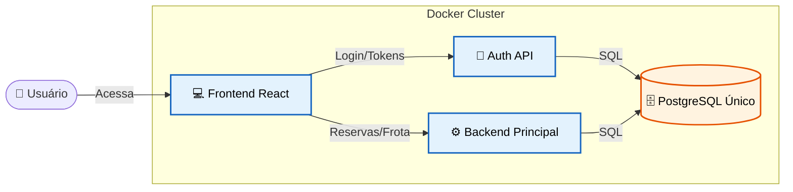

# Bem-vindo ao FrotaNext

!!! info "O que é o FrotaNext?"
    O **FrotaNext** é uma plataforma moderna e escalável de **Aluguel de Veículos (Rent-a-Car)**. 
    
    Projetado com uma arquitetura de microsserviços, o sistema gerencia todo o ciclo de vida da locação: desde a vitrine de veículos e reserva pelo cliente, até a gestão de frotas, motoristas corporativos e aprovações administrativas.

---

!!! tip "Assista ao Vídeo do FrotaNext Funcionando"
    

      
      
<em>Clique na imagem para assistir no YouTube.</em>

    

---

## 🏛️ Arquitetura em Resumo

O sistema foi construído sobre o princípio da **separação de responsabilidades**. Em vez de um monólito gigante, dividimos a aplicação em serviços especializados que rodam em contêineres Docker orquestrados.

O tráfego é roteado pelo Frontend, que se comunica com duas APIs distintas: uma para **Identidade** (Auth Service) e outra para **Regras de Negócio** (Backend Principal), ambas compartilhando um banco de dados robusto.

-----

## 🛠️ Stack Tecnológica

Utilizamos tecnologias modernas para garantir performance, tipagem segura e facilidade de manutenção.

=== "💻 Frontend"
* **React 18 (Vite):** Para uma interface super rápida (SPA).
* **TypeScript:** Segurança de tipos e menos bugs.
* **Tailwind CSS:** Estilização moderna e responsiva.
* **React Hook Form:** Gestão eficiente de formulários complexos.

=== "⚙️ Backends"
* **Python 3.11:** Linguagem base.
* **FastAPI:** Framework de alta performance e assíncrono.
* **SQLAlchemy + Pydantic:** ORM e validação de dados rigorosa.
* **Pytest:** Suíte de testes automatizados.

=== "☁️ Infraestrutura"
* **Docker & Docker Compose:** Containerização total do ambiente.
* **PostgreSQL 15:** Banco de dados relacional com herança de tabelas.
* **Nginx (Produção):** Proxy reverso e gestão de SSL.

-----

## 🚀 Funcionalidades Principais

O sistema atende a três perfis distintos de usuário, cada um com fluxos exclusivos.

### :material-account: Para Clientes (Pessoa Física)

  * **Vitrine Digital:** Navegação por categorias (Passeio, Utilitário, Moto).
  * **Reserva Inteligente:** Simulação de preços em tempo real antes de confirmar.
  * **Minhas Viagens:** Histórico completo e status das reservas atuais.

### :material-domain: Para Empresas (Pessoa Jurídica)

  * **Gestão de Condutores:** Painel exclusivo para cadastrar motoristas (CPF) vinculados ao CNPJ.
  * **Delegação de Retirada:** A empresa paga, mas indica qual funcionário irá retirar o carro.

### :material-security: Para Administradores

  * **Dashboard de KPIs:** Gráficos de ocupação da frota e agenda do dia.
  * **Controle de Frota:** Cadastro e manutenção de veículos.
  * **Operação de Pátio:** Registro de **Retirada** e **Devolução** com cálculo automático de multas.

-----

!!! tip "Por onde começar?"
Se você é um desenvolvedor e quer rodar o projeto agora mesmo, vá para o [Guia de Instalação e Setup](dev/instalacao.md).